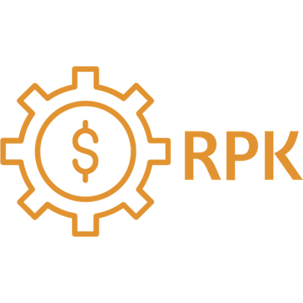

# Portfolio / Personal Webpage

This project is my personal webpage if you open it you can find information about me and the projects I did earlier or currently working on.

## Badges

     

## Main Features

- Responsive
- Light/dark mode toggle
- EN/HU language toggle
- Routing

## License

[MIT](https://choosealicense.com/licenses/mit/)